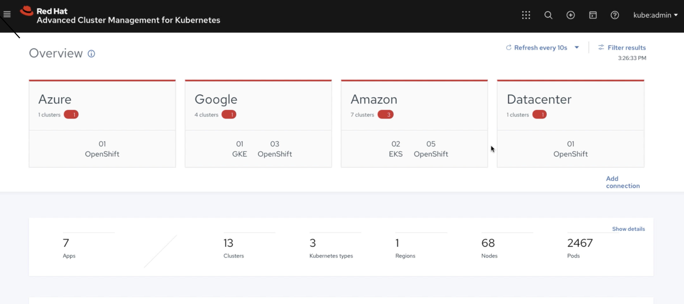

# Introduction

This repository contains all necessary steps and manifests to demonstrate RHACM capabilities.

After completing this tutorial you will be able to accomplish the following tasks:

- Multi-cluster lifecycle management
- Observability capabilities
- Multi-cluster day 2 management and configuration (policy, governance)
- Application lifecyle management

 

# Requirements
 - Openshift 4.5+ declared as a Hub
 - Openshift 4.5+ declared as a managed cluster
 - oc cli 

# Setup

ssh -o ServerAliveInterval=20 atiouajn-redhat.com@bastion.c6b3.sandbox1886.opentlc.com
git clone https://github.com/atiouajni/bluegreen.git
oc new-project bluegreen
oc apply -f openshift-manifests

ssh -o ServerAliveInterval=20 atiouajn-redhat.com@bastion.9efa.sandbox134.opentlc.com
git clone https://github.com/atiouajni/bluegreen-rhacm.git
oc new-project bluegreen
oc apply -f rhacm-manifests/

oc new-project rhacm-policies
oc apply -f rhacm-manifests/policies

# Installation

# Usage

# Encountered issues

**Issue :**
status:
  lastUpdateTime: '2020-11-25T10:23:04Z'
  message: Active
  phase: PropagationFailed
  reason: couldn't find remote ref "refs/heads/master"

# Cleanup

# Documentation

# Released versions

